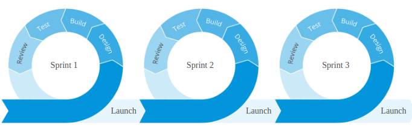

https://coderacademy.instructure.com/courses/288/assignments/1464

## Q1.	Describe the architecture of a typical Rails application (200-300)

At a high level the typical Rails application will be coded under two guiding principles, DRY - Don't Repeat yourself, e.g don't duplicate code and "Convention over Configuration" which means rails has certain conventions that it wants you to use when developing in rails. e.g naming conventions such as matching names and capitalization.

The typical architecture of a Rails application relies on a framework known as the Model-View-Controller or MVC. It splits the functionality of the rails application into three distinct parts, the model, the view and the controller.

The Model (also known as active record) primarily deals with data and the manipulation of the database. The model also makes use of Object Relational Mapping to manipulate data which allows us to interact with the database without having to write SQL plus we get the added benefit of being able to switch databases e.g postgresql, mysql etc.
The View (action view in rails) handles user interfaces and graphical components that the user will see. 
And lastly the Controller (action controller) interacts with both the model and views. The Controller handles incoming requests from users/browsers and also acts as a middle-man to direct requests from the view to the model and vice-versa. Your standard application may make use of many different models, views and controllers.

The typical rails application uses puma as webserver and relies on routes that are defined in routes.rb to handle http requests by finding the correct controller and action. It can be run locally on localhost:3000 or deployed on services such as heroku.

The rails application may also have styling derived from the Asset Pipeline, the pipeline is a framework that allows rails to link assets and styling files together to allow for faster processing.

##### References
* https://www.tutorialspoint.com/mvc_framework/mvc_framework_introduction.htm
* https://guides.rubyonrails.org/getting_started.html#what-is-rails-questionmark
* https://guides.rubyonrails.org/routing.html
* https://blog.bitsrc.io/what-is-an-orm-and-why-you-should-use-it-b2b6f75f5e2a
* image - https://betterexplained.com/articles/intermediate-rails-understanding-models-views-and-controllers/

---
## Q2.	Identify a database management system (DBMS) commonly used in web applications (including Rails) and discuss the pros and cons of this database (150-250)

ACME Corporation is very big on project management, documentation and process. This will be a key metric in their decision to award the project. The following set of questions relate to this RfQ-requirement.

---
## Q3. Discuss the implementation of Agile project management methodology (200-300) 

The Agile methodology was developed with the goal of improving software development. Agile's four main values are an emphasis 
on 
* Valuing individuals and interactions over processes and tools
* Developing working software versus documentation 
* Collaborating with customers versus contract negotiation
* Quickly responding to change versus following a plan

The Agile methodology advocates developing projects and software through constant iteration and collaboration to address the needs of customers.  

It may be useful to compare the Agile and Waterfall methodology as they're both used in project management but under different circumstances. 

In the past software was mainly developed through the waterfall methodology, at the time it was a useful way to develop software as requirements and technology were slow in changing. It was also easy to understand and follow as each phase had clear goals. Customers were only involved at the start and end of a project. This could lead to issues such as customer's needs changing which are usually expensive to address due to rewriting of projects and code.

In contrast, in Agile, customers are constantly involved throughout the development of the project and their feedback can be quickly incorporated into the project. Agile also relies on short sprints or cycles that involve designing, building, testing and review. These cycles can repeat and this is in contrast to the waterfall method which generally has longer time periods and non-repeating phases.

Below is an example of a 3 cycles or sprints linking together.

In today's age with the rapid development of start-ups and software, organisations have to be flexible and quick to respond to customer's needs. The agile method caters to this need by allowing for rapid prototyping and development of software, this allows customers to examine the progress of software development quickly, in contrast to the waterfall methodology, in which, projects may take years before they have a product to show.

##### References   
* https://www.agilealliance.org/agile101/12-principles-behind-the-agile-manifesto/
* https://www.infoworld.com/article/3237508/what-is-agile-methodology-modern-software-development-explained.html
* https://www.guru99.com/waterfall-vs-agile.html
* https://www.projectmanager.com/software/use-cases/waterfall-methodology
* image - https://www.mendix.com/blog/agile-process-why-you-need-feedback-loops-both-during-and-after-sprints/

---
## Q4.	Provide an overview and description of a standard source control workflow (100-200)

A standard source control workflow would be implemented through the use of a version control system such as Git. Git helps to keep track of changes made to code, this is done through pushing snapshots of the current source code to an online or remote location known as a repository.
In the typical project there will be one main source code known as the master branch which is not typically directly used when writing code.
New features are typically developed in branches, developers can make use of branches which allow you to make a copy of the master code and edit it without affecting the original, this can ensure that the master branch always has working code. When the feature or code is completed on a branch it can be merged back with the master code, this would usually be done through a pull request which is essentially asking permission to merge the branch code with the master, the pull request also gives other developers a chance to review the code and suggest changes.
Git also has extensive logs of changes made to code whether it's on the master branch or feature branches.

##### References
* https://www.howtogeek.com/180167/htg-explains-what-is-github-and-what-do-geeks-use-it-for/
* https://www.atlassian.com/git/tutorials/why-git

---
## Q5.	Provide an overview and description of a standard software testing process (e.g. manual testing) (100-200)

A standard software testing process could be the use of automated testing, this testing involves the use of automation software to carry out the job of testing. 
The process of automated testing would closely follow the software testing life cycle (STLC). It begins with gathering requirements which defines what should be tested, a feasibility analysis - to see if automation is possible/within budget, a requirement traceability matrix - which would detail test scenarios and their status(whether they pass/fail).
A testing plan can then be made which will detail the criteria and strategy for the automation test, it may detail what automation software to be used, costs involved, training required and what automation testing framework may be used. 
Test case development and execution will involve the creation of automation scripts for each test case and the running of those automation tests. Detailed logs and reports will be collected regarding each case. 
The test cycle closure is the final stage and will be an evaluation of the overall cycle and metrics obtained from testing. This may involve analysis of test findings and list strategies to be incorporated into future testing cycles.

##### References
* https://www.guru99.com/automation-testing.html
* https://www.guru99.com/software-testing-life-cycle.html#2
* https://www.atlassian.com/continuous-delivery/software-testing/types-of-software-testing
* https://www.guru99.com/traceability-matrix.html

---

Having suffered several cyber attacks in the past and resultant remedial audits ACME Corporation takes compliance, security and privacy very seriously. The following set of questions relate to this RfQ-requirement.

## Q6.	Discuss and analyse requirements related to information system security and how they relate to the project (100-200)

Discuss - for and against
Analyse - break the essay topic down into fundamental parts

##### References

## Q7. Discuss common methods of protecting information and data and how you would apply them to the project (100-200)

A common method of protecting information and data would be to implement authentication, this could be done through the use of a gem such as Devise to require users to have a login and password before they could access the application. A benefit of authentication is this would protect personal user data and information in a quick and simple way. Cons of using a user login system, is that it's up to users to be vigilant with their passwords and to also generate complex and unique passwords.

We could also implement authorisation as a method to protect data, this would restrict the permissions of users. For example we would only want users to be able to change their contact details and not someone else's. This also ties into the principle of giving entities the fewest privileges possible. For example an admin may have the power to remove a user but we would disable that function for anyone who wouldn't require it e.g a user or even an employee. This reduces our risk to vulnerabilities because if you gave that permission to users or employees who didn't require it, they also become points of failure.

##### References
* https://www.keycdn.com/blog/web-application-security-best-practices
* https://www.synopsys.com/blogs/software-security/complete-web-application-security-testing-checklist/

---
## Q8.	Research what your legal obligations are in relation to handling user data and how they can be met for the project (100-200)

According to the Office of the Australian Information Commissioner (OIAC), any organisation must notify individuals when a data breach is likely to cause serious harm to the individual.

The OIAC also offers a set of guidelines known as The Australian Privacy Principles (APP). With these guidelines as a reference we can construct a general idea of how we should be handling user data.

User data can be collected, used, disclosed, stored, destroyed and de-identified.
Before we even write any code we can plan out what we want to do with user data, e.g what information will we collect? how will we store it? 

To meet our legal and moral obligations to users. We can implement various techniques such as password hashing which involves using a hash function to convert a password to a essentially a string that looks random in pattern. 

We can also employ authorisation through limiting of user access, so that entities only have access to their data and authentication through login/password and multifactor-authentication, so that entities are who they claim to be. 

Lastly we can also consult with cybersecurity experts to offer their recommendations on how data should be handled and to perform penetration tests on our systems for vulnerabilities.

##### References
* https://www.oaic.gov.au/privacy/guidance-and-advice/data-breach-preparation-and-response/part-1-data-breaches-and-the-australian-privacy-act/
* https://www.oaic.gov.au/privacy/australian-privacy-principles-guidelines/
* https://auth0.com/blog/hashing-passwords-one-way-road-to-security/

---
## Q9.	Describe the structural aspects of the relational database model. Your description should include information about the structure in which data is stored and how relations are represented in that structure. (100-200)
Main characteristics, descriptive

A relational database organises it's data and relations into tables. These tables 

Structure in which data is stored
How relations are rep in that structure

##### References

---
## Q10.	Describe the integrity aspects of the relational database model. Your description should include information about the types of data integrity and how they can be enforced in a relational database. (100-200)

##### References

---
## Q11.	Describe the manipulative aspects of the relational database model. Your description should include information about the ways in which data is manipulated (added, removed, changed, and retrieved) in a relational database. (100-200)

##### References

---
## Q12.	Identify and explain the workings of TWO sorting algorithms and discuss and compare their performance/efficiency (i.e. Big O) (300-500)

##### References

---
## Q13.	Identify and explain the workings of TWO search algorithms and discuss and compare their performance/efficiency (i.e. Big O) (300-500)

Linear search
Possibly the simplest search to implement and understand, the linear search has a time complexity of O(n) and involves looking at every element one after the other. For example, for an array of 5 numbers a linear search would start at index 0 and check if the number is the one it was looking for and then continue moving up the index until it found it's number or reached the end and conclude the number did not exist. A linear search could be used on an unsorted array as you may need to look at each element to see if it is the one we want.

Binary search
A binary search works by continually dividing the data in half until it finds the correct element. It usually requires the data to be sorted appropriately for it to be effective. An example to demonstrate this could be 5 numbers 10,35,68,90,100 sorted in ascending order and we wanted to find the number 100. A binary search would first attempt to take the mid-point of the input data and check if this value was the one we're looking for, in this case it would look at the last index, index 4, divide that in half to get 2, and then check if index 2 was 100. Since index 2 is 68 and not 100 it would then discard the lesser half of numbers and continue dividing and searching with the remaining data until the number was found or it concluded the number did not exist in the array.

In regards to the perfomance/efficiency of Linear search against Binary search, it may not be relevant to compare the two as they are best used for different purposes. Linear search would mainly be used on unsorted arrays as you need to look at each element to determine if it's the correct one and Binary searches require appropriately sorted arrays.
We can however compare the Big O notation or of these searches to see if there is a difference in performance/efficiency.
Linear search's Big O notation or worst case is O(n), so as input data increases, it's time taken also increases linearly or directly proportional to input data.
Binary search, however, can be more efficient when you have the appropriate sorted array, at it's worst it may have a Big O of O(logn) as input data grows, the complexity does not increase proportionally but logarithmically, which shows a curve of complexity that flattens out as input data increases to infinity.

  
The below graph shows the Big O of "Linear Time" -green line, which is what Linear Search's big O would look like and "Logarithmic Time" - red line which is what Binary Search's big O would be.

##### References

* https://www.geeksforgeeks.org/linear-search/
* https://www.geeksforgeeks.org/binary-search/
* https://www.khanacademy.org/computing/computer-science/algorithms/binary-search/a/implementing-binary-search-of-an-array
* https://rob-bell.net/2009/06/a-beginners-guide-to-big-o-notation/
  

---
## Q 14. 	Conduct research into a marketplace website (app) and answer the following parts:  
 ### a. List and describe the software used by the app.

HTML
CSS - styling of html
Javascript
jQuery
React
Java
Amazon CloudFront - content delivery system
Nginx - open source web server
Bootstrap - framework for developing mobile-responsive designs
Google cloud hosting - hosting of website
Google analtics - marketing and traffic analysis
Paypal / Visa - payment tools

<!-- Do programming languages count as software? -->

Shown below is a fuller list of software used by the app - taken from stackshare

 ### b. Describe the hardware used to host the app.

The hardware used to host Gumtree would be web/data servers using nginx as the web server software. The web server software would allow for HTTP requests for content from clients to be handled and addressed.
Gumtree also makes use of content delivery networks and cloud hosting which require a distributed network of servers. Specifically the servers for a content delivery network are geographically distanced while for cloud hosting the data is stored on different servers.
In regards to cloud hosting, Gumtree uses Google Cloud hosting to make it's website scalable and reliable.

 ### c. Describe the interaction of technologies within the app

Gumtree would be hosted through google cloust hosting, a user would request content from the browser which would be sent as a HTTP request to nginx(webserver software). Nginx would send back a response which could be a mixture of HTML, CSS, javascript, jQuery and React, these technologies would form the basis for a responsive website. This response could also be passed to Amazon CloudFront which would attempt to send back the response from the server to the client through the most effecive path.

 ### d. Describe the way data is structured within the app
Describe (in general terms) the data structure of two-sided marketplace applications (e.g. eBay, Airbnb)

 ### e. Identify entities which must be tracked by the app
Identify entities which must be tracked by the application

 ### f. Identify the relationships and associations between the entities you have identified in part (e)
Identifies all relationships / associations in a sophisticated relational model

 ### g. Design a schema using an Entity Relationship Diagram (ERD) appropriate for the database of this website (assuming a relational database model)

 Designs a normalised schema (i.e. without data duplication) that facilitates extended functionality of the app

##### References

* 14a.
* https://stackshare.io/gumtree-com/gumtree-com
* https://builtwith.com/gumtree.com
* 14b.
* https://myip.ms/view/web_hosting/616098/Marktplaats_B_v.html
* https://developer.mozilla.org/en-US/docs/Learn/Common_questions/What_is_a_web_server
* https://www.cloudflare.com/learning/cdn/what-is-a-cdn/
* https://www.wirehive.com/thoughts/cloud-hosting-work/

